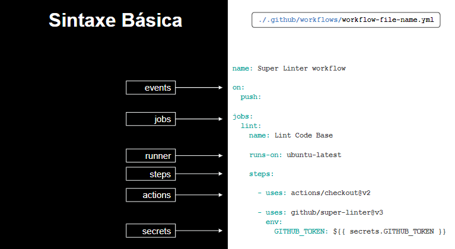

# Desenvolvimento Moderno

## Codespaces
- Ambientes de desenvolvimento acessíveis online no navegador.
- Permite o desenvolvimento, execução e depuração de projetos. diretamento do navegador.

## Copilot
- Forcado em forncer uma experiência para o desenvolvedor que permita que as pessoas tenha melhor aproveitamento em sua rotina, ou seja, você ganha um assistente de codificação.
- Funcionalidade:
    - Sugestão de código
    - Documentação com comentários
    - Criação de testes unitários
    - Respostas a perguntas

## Actions
- Ferramenta de automação de fluxos de trabalho, incluindo:
    - Construções de projetos
    - Testes
    - Implantações
    - Gerenciamento de problemas

### Workflows
- Um arquivo de workflow do GitHub Actions (scripts automatizados) é um arquivo de texto armazenado no repositório do seu projeto, geralmente localizado em .github/workflows. Cada workflow consiste em uma série de "jobs", que são tarefas individuais executadas em um ambiente isolado (container). Os jobs podem ser configurados para executar comandos específicos, como:
    - Compilar código
    - Executar testes
    - Implantar alterações
    - Enviar notificações
- Os workflows são escritos em YAML (Ain't Markup Language), e define um fluxo de trabalho automatizado que pode ser acionado por eventos específicos.
- Estrutura de arquivos workflows:
    - Eventos (on:): os eventos que acionarão o workflow. Por exemplo, "push" para commits ou "pull_request" para pull requests.
    - Jobs: um ou vários jobs que serão executados quando o workflow for acionado. Cada job é executado em um ambiente isolado (runner/agente).
        - Vários jobs podem ser executados simultaneamente, reduzindo o tempo total de execução do workflow.
        - Os jobs podem ser encadeados usando a palavra-chave "needs". Isso permite que um job dependa da conclusão bem-sucedida de outro job antes de ser executado.
        - Os jobs são compostos por uma sequência de etapas, que são tarefas específicas a serem executadas.
        - As etapas podem ser comandos de shell simples (usando a ação "run") ou ações reutilizáveis (usando a ação "uses").
    - Steps (passos): passos específicos que serão executados dentro de cada job. Os steps podem incluir comandos personalizados ou ações reutilizáveis.
    - Actions (ações): ações são steps reutilizáveis que podem ser compartilhados entre diferentes workflows. Elas encapsulam tarefas comuns, como construir, testar ou implantar código.

    

### CI/CD Workflows
- Essa sigla se refere às expressões Continuous Integration e Continuous Delivery que, traduzidas para o português, significam Integração Contínua e Entrega Contínua. Esses dois processos representam inovações no modelo de desenvolvimento e entrega de projetos de TI: são conjuntos de metodologias, técnicas e ferramentas que tornam o fluxo todo mais ágil, eficiente e otimizado.
- Conceitos base:
    - Integração
    - Entrega
    - Implantação contínua
- Ao integrar os workflows do GitHub Actions em seus pipelines de CI/CD, as equipes de desenvolvimento podem:
    - Automatizar tarefas repetitivas e demoradas, liberando tempo para se concentrar em atividades de maior valor.
    - Criar pipelines personalizados que atendam às necessidades específicas de seus projetos e fluxos de trabalho.
    - Monitorar o progresso dos pipelines e identificar quaisquer problemas ou gargalos.
    - Facilitar a colaboração entre equipes de desenvolvimento e operações, fornecendo uma plataforma centralizada para gerenciar pipelines de CI/CD.